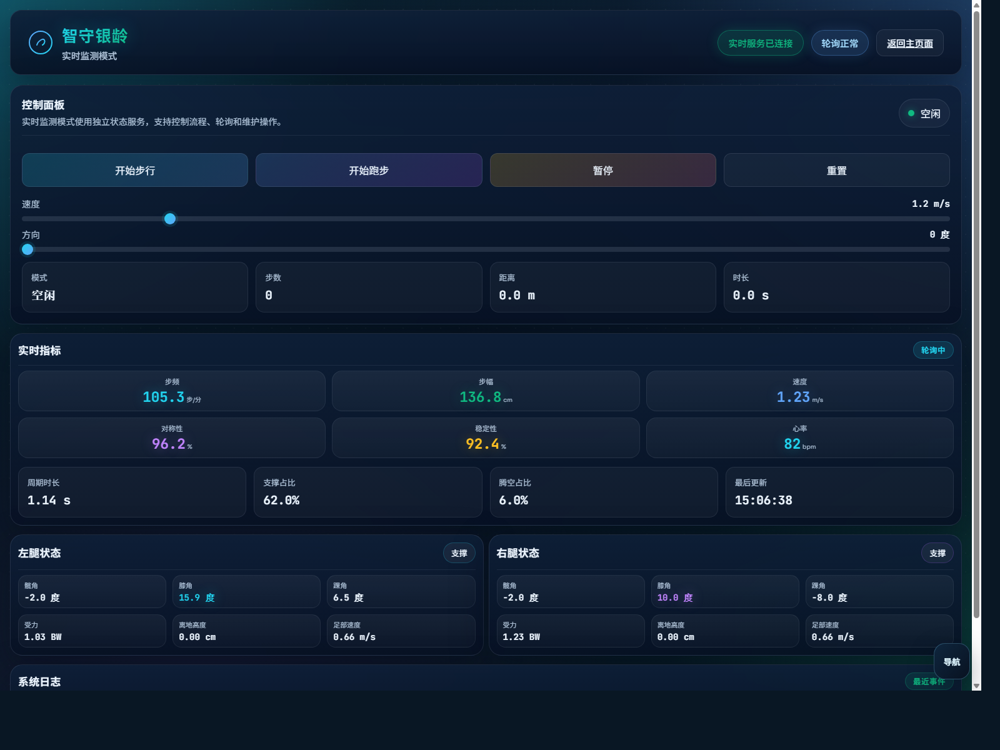
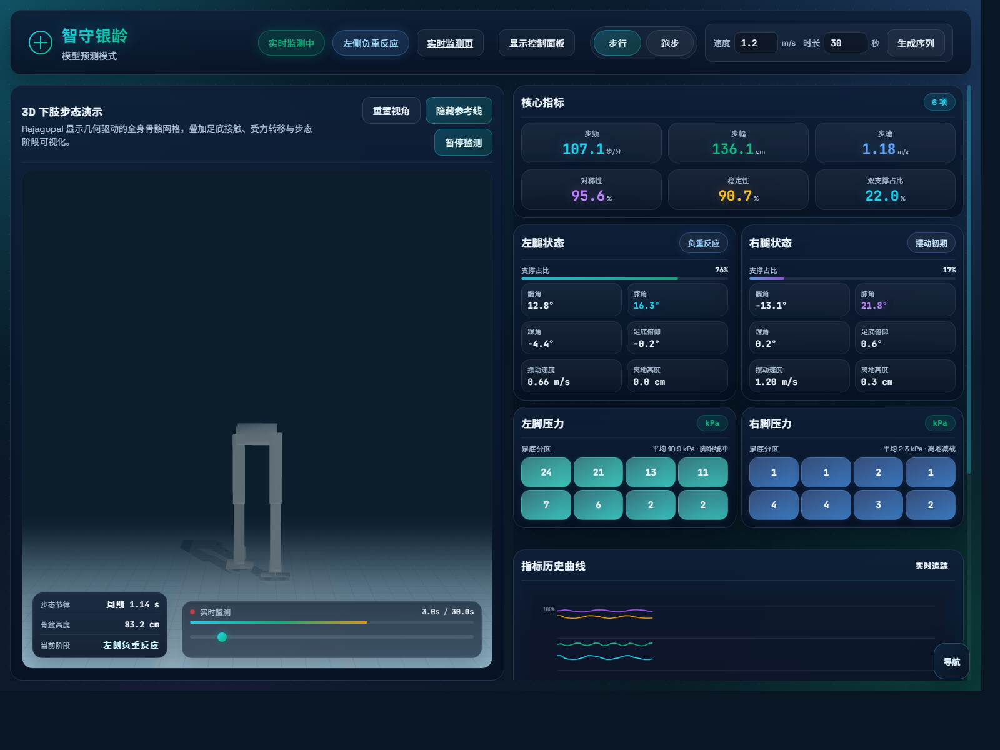
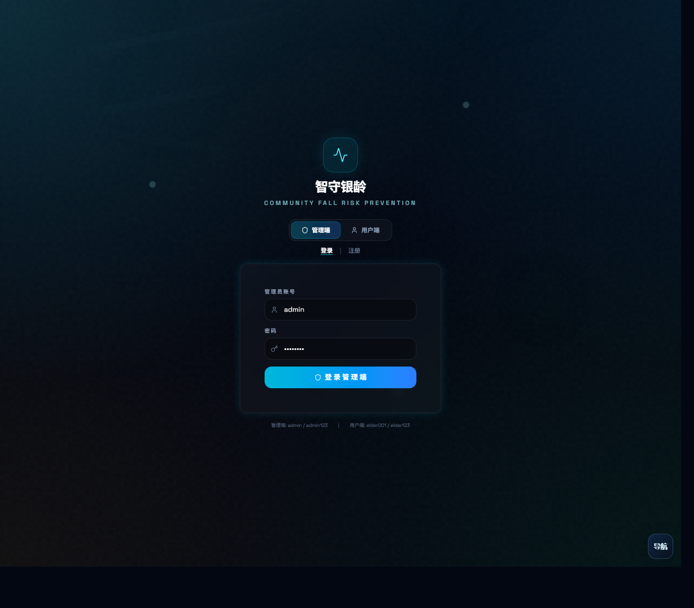

# 智守银龄 · 风险未然

<p align="center">
  <strong>基于风险状态演化建模的社区老年跌倒风险动态预警与干预系统</strong>
</p>

<p align="center">
  <a href="https://img.shields.io/badge/Competition-China%20Collegiate%20Computing%20Contest-2563eb"></a>
  <a href="https://img.shields.io/badge/Deploy-GitHub%20Pages-0ea5e9"></a>
  <a href="https://img.shields.io/badge/Frontend-Static%20Web-10b981"></a>
  <a href="https://img.shields.io/badge/IMU-NGIMU%20Bridge-8b5cf6"></a>
</p>

<p align="center">
  <a href="#项目定位">项目定位</a> ·
  <a href="#在线演示">在线演示</a> ·
  <a href="#核心功能">核心功能</a> ·
  <a href="#ngimuwifi-硬件接入">硬件接入</a> ·
  <a href="#技术架构">技术架构</a> ·
  <a href="#本地运行">本地运行</a> ·
  <a href="#参赛说明">参赛说明</a>
</p>

---

## 项目定位

**智守银龄**面向社区老年健康管理场景，围绕“跌倒风险早发现、早预警、早干预”的核心目标，构建了一个可静态部署、可演示闭环业务流程、可本地接入 IMU 传感设备的智能化应用原型。

项目以社区老年人为服务对象，以基层健康管理人员、社区医生、护理人员和家属为主要使用者，通过步态数据采集、风险状态演化建模、可视化解释、告警处置和干预回访，形成“**监测 - 评估 - 预警 - 干预 - 回访**”的一体化工作流。

### 解决的问题

| 痛点 | 现状问题 | 本项目方案 |
|---|---|---|
| 风险发现滞后 | 传统体检和量表评估多为阶段性记录，难以及时捕捉步态异常 | 通过 IMU 步态监测、步态指标趋势和风险分层，实现连续化风险观察 |
| 数据链路割裂 | 采集、分析、预警、处置分散在不同工具中 | 将系统端、模型预测、实时监测和硬件接入统一到一个参赛应用入口 |
| 基层部署受限 | 社区场景通常缺少专业服务器和复杂运维条件 | 主体演示支持 GitHub Pages 静态部署，本地硬件接入通过轻量 Python SDK 完成 |
| 干预闭环不足 | 告警后缺少任务追踪、回访记录和处置状态 | 系统端提供风险看板、用户管理、设备数据、告警处置和报表展示 |

### 参赛价值

本作品不仅展示一个前端页面，而是围绕中国大学生计算机设计大赛的评审场景，补齐了“选题背景、业务闭环、算法链路、系统实现、硬件扩展、部署方式、演示路径、团队分工”等材料。评审可以在无硬件环境下查看完整静态演示，也可以在本地启动 NGIMU/WiFi IMU 接入层观察实时数据流。

---

## 在线演示

> 当前仓库为静态构建产物，可直接部署到 GitHub Pages。若仓库绑定 `CNAME`，线上入口通常为：`https://cian.fun/`。

| 页面 | 说明 | 入口 |
|---|---|---|
| 项目首页 | 项目介绍、模块总览、统一演示入口 | [进入首页](./index.html) |
| 系统端 | 管理端/用户端一体化工作台，包含风险评估、用户管理、设备数据、告警处置和报表展示 | [进入系统端](./system/) |
| 模型预测页 | 下肢步态序列生成、Rajagopal 骨骼可视化、足底压力和步态指标联动 | [进入模型预测页](./records/) |
| 实时监测页 | 步行/跑步状态控制、实时指标轮询、状态日志与腿部状态显示 | [进入实时监测页](./records/realtime.html) |
| 硬件接入页 | 接入本地 NGIMU/WiFi IMU 桥接 API，查看设备列表、实时样本和轨迹趋势 | [进入硬件接入页](./records/ngimu.html) |

### 演示账号

系统端内置演示账号：

```text
用户名：admin
密码：admin123
```

### 页面预览

| 模型预测 | 记录看板 | 系统端 |
|---|---|---|
|  |  |  |

---

## 核心功能

### 1. 社区健康管理工作台

- 管理端支持重点人群、风险等级、告警处置、干预任务和统计报表展示。
- 用户端支持个人健康指标、预警记录、干预建议和跟踪状态查看。
- 内置模拟数据，适合比赛现场、答辩演示和线上静态访问。
- 统一导航浮层贯穿首页、系统端、模型预测、实时监测和硬件接入页。

### 2. 步态预测与 3D 可视化

- 基于步态序列的下肢运动模拟，支持步行/跑步模式切换。
- 支持速度、时长参数调节，实时生成步态片段。
- 使用 Rajagopal/OpenSim 下肢骨骼数据进行可视化表达。
- 展示步频、步幅、步速、对称性、稳定性、双支撑占比等关键指标。
- 展示左右腿髋/膝/踝角度、足底俯仰、摆动速度、离地高度和足底压力分布。

### 3. 实时监测与控制面板

- 提供开始步行、开始跑步、暂停、重置等实时控制动作。
- 通过 `/api/realtime/*` 接口抽象状态服务；静态部署时由前端 mock 层自动接管。
- 显示步数、距离、时长、步频、步幅、速度、对称性、稳定性、心率等指标。
- 记录最近系统事件，便于展示数据轮询、状态变化和控制反馈。

### 4. NGIMU/WiFi 硬件接入

- 新增 `records/ngimu.html`，可连接本机 `http://127.0.0.1:18000/api` 或 `http://127.0.0.1:8000/api`。
- 显示设备列表、最新设备、历史容量、最近更新时间。
- 显示姿态角、加速度、角速度、轨迹速度、运动状态、轨迹修正状态、运动置信度。
- 展示电量、电压、RSSI、温度、Acc/Gyro/Track 向量。
- 使用 Canvas 绘制 TrackX/TrackZ 三维轨迹投影与 AccMagnitude 加速度趋势。
- 支持打开原本地看板、刷新设备、清空当前设备历史轨迹和复制启动命令。

---

## NGIMU/WiFi 硬件接入

本次已将 `E:\TJUTCM\Activities\中国大学生计算机设计大赛\NGIMU-Software-Public-master\NGIMU-Software-Public-master` 中最适合当前应用的轻量部分整合到本仓库：

```text
integrations/ngimu-wifi/
├── run_dashboard.py             # 独立 WiFi IMU 接收端 + Web/API 看板
├── run_ngimu_web_bridge.py      # NGIMU GUI + Web/API 统一桥接器
├── device_model.py              # BS 54 字节帧解析、姿态/运动衍生字段
├── device_api.py                # 本地 HTTP API 与静态看板服务
├── simulate_device.py           # 无硬件模拟器
├── bs_to_ngimu_gui_bridge.py    # BS 帧到 NGIMU OSC 消息桥接
├── ngimu_osc.py                 # NGIMU OSC 消息编码
├── udp_service.py / tcp_service.py
└── web/                         # 原本地设备看板
```

### 设计取舍

- **已整合**：轻量 Python SDK、设备模拟器、本地 HTTP API、Web 看板、NGIMU GUI 桥接思路、Gait-Tracking 风格 ZUPT 轨迹字段、IMU-Mocap 风格下肢模板思路。
- **未直接整合**：完整 C# WinForms `NGIMU.sln`、旧版 GUI 编译产物和大体量示例工程。它们适合独立开发/调试，不适合直接放进静态参赛前端。
- **当前定位**：主应用负责比赛展示和综合工作流；`integrations/ngimu-wifi` 负责本地设备接入；`records/ngimu.html` 负责把本地设备数据纳入当前应用。

### 启动统一桥接器

适合同时使用 NGIMU GUI 与当前应用硬件接入页：

```powershell
cd integrations\ngimu-wifi
python run_ngimu_web_bridge.py --protocol UDP --device-port 1399 --gui-port 8000 --api-port 18000 --open-browser
```

然后打开：

```text
records/ngimu.html
API 地址：http://127.0.0.1:18000/api
```

设备侧配置为向当前电脑 IPv4 发送数据，协议 `UDP`，端口 `1399`。

### 单独启动 WiFi 看板

适合不使用 C# NGIMU GUI，只接入 Web/API：

```powershell
cd integrations\ngimu-wifi
python run_dashboard.py --protocol UDP --device-port 1399 --api-port 8000 --open-browser
```

此时当前应用硬件接入页使用：

```text
API 地址：http://127.0.0.1:8000/api
```

### 无硬件模拟

先启动 `run_dashboard.py` 或 `run_ngimu_web_bridge.py`，再另开一个 PowerShell：

```powershell
cd integrations\ngimu-wifi
python simulate_device.py --protocol UDP --host 127.0.0.1 --port 1399
```

多设备下肢模板演示：

```powershell
python simulate_device.py --protocol UDP --host 127.0.0.1 --port 1399 --template lower-body --device-count 4
```

单 IMU 轨迹诊断演示：

```powershell
python simulate_device.py --protocol UDP --host 127.0.0.1 --port 1399 --template gait-single
```

### 常用硬件 API

| 接口 | 方法 | 说明 |
|---|---|---|
| `/api/health` | GET | 服务状态、设备数量、最新设备、历史容量 |
| `/api/devices` | GET | 设备列表 |
| `/api/latest` | GET | 最新收到的设备快照 |
| `/api/devices/{device_id}` | GET | 指定设备最新快照 |
| `/api/devices/{device_id}/data` | GET | 指定设备最新数据字段 |
| `/api/devices/{device_id}/history?limit=300` | GET | 指定设备历史样本 |
| `/api/devices/{device_id}/history` | DELETE | 清空指定设备历史样本 |

### 数据说明

- 当前 WiFi 设备帧为 `BS...` 开头的 54 字节二进制帧。
- 原始字段包括时间、加速度、角速度、磁场/姿态角、温度、电池、电压、RSSI、版本等。
- 衍生字段包括四元数、旋转矩阵、线性加速度、地球坐标加速度、TrackX/TrackY/TrackZ、TrackSpeed、MotionState、TrackStatus 等。
- `TrackX/TrackY/TrackZ` 参考 Gait-Tracking 的 AHRS + ZUPT 思路，用于短时相对运动诊断，不等同于 GPS 定位。
- 当前 54 字节帧没有 GPS 经纬度，页面不会把 IMU 估计伪装成真实地图轨迹。

---

## 技术架构

### 前端技术栈

| 技术 | 用途 |
|---|---|
| HTML/CSS/JavaScript | 静态部署入口、硬件接入页、记录模块 |
| React 19 | 首页与系统端构建产物 |
| TypeScript | 系统端源项目类型安全基础 |
| Vite 6 | 前端构建工具 |
| Tailwind CSS 4 | 系统端样式体系 |
| Motion | 动画与交互过渡 |
| Three.js | 3D 下肢可视化、骨骼/模型渲染 |
| Canvas 2D | 实时曲线、轨迹投影、趋势图 |
| Python 3 | 本地 WiFi IMU/NGIMU 接收、桥接和模拟 |

### 系统链路

```text
传感设备 / 模拟器
    │
    ├─ UDP/TCP:1399
    │
integrations/ngimu-wifi
    │
    ├─ BS 帧解析
    ├─ 姿态/加速度/轨迹衍生字段
    ├─ 可选 OSC 转发到 NGIMU GUI
    └─ HTTP API:8000/18000
          │
          ├─ records/ngimu.html       # 当前应用硬件接入页
          └─ integrations/.../web     # 原轻量设备看板
```

### 风险业务闭环

```text
步态监测
  ↓
特征提取：步频、步幅、步速、对称性、稳定性、双支撑占比
  ↓
风险状态演化：短期异常、趋势变化、个体基线偏移
  ↓
分层预警：低/中/高风险与可解释指标
  ↓
干预处置：社区随访、运动建议、环境评估、家属提醒
  ↓
回访评估：干预结果记录与风险状态更新
```

### 项目结构

```text
智守银龄/
├── index.html                         # 项目首页
├── assets/                            # 首页构建产物与预览图
├── system/                            # 系统端静态构建产物
├── records/                           # 步态监测与实时演示模块
│   ├── index.html                     # 模型预测页
│   ├── realtime.html                  # 实时监测页
│   ├── ngimu.html                     # NGIMU/WiFi 硬件接入页
│   ├── control.html                   # 控制面板页
│   └── static/
│       ├── css/style.css
│       ├── data/rajagopal-lower-geometry.json
│       └── js/
│           ├── app.js
│           ├── realtime.js
│           ├── ngimu-bridge.js
│           ├── mock-api-static.js
│           └── skeleton-overlay.js
├── integrations/
│   └── ngimu-wifi/                    # 已整合的轻量硬件接入 SDK
├── shared/
│   └── site-shell.js                  # 全局浮动导航
├── image/README/                      # README 图片资源
├── .github/workflows/deploy.yml       # GitHub Pages 自动部署
├── 启动预览.bat
└── README.md
```

---

## 本地运行

### 方式一：Windows 一键预览

双击：

```text
启动预览.bat
```

脚本会启动本地静态服务器并打开浏览器。

### 方式二：Python 静态服务器

```powershell
python -m http.server 8080
```

访问：

```text
http://127.0.0.1:8080/
```

### 方式三：Node.js 静态服务器

```powershell
npm install -g serve
serve -p 8080
```

访问：

```text
http://127.0.0.1:8080/
```

### 硬件联调建议

比赛现场建议开三个窗口：

| 窗口 | 命令/页面 | 作用 |
|---|---|---|
| 静态应用 | `python -m http.server 8080` | 打开当前参赛应用 |
| 硬件接收端 | `python run_ngimu_web_bridge.py ...` | 接收设备数据并提供 API |
| 模拟器或设备 | `python simulate_device.py ...` 或真实设备 | 产生 IMU 数据流 |

---

## GitHub Pages 部署

仓库已包含 `.github/workflows/deploy.yml`，推送到 `main` 或 `master` 分支后可自动发布 GitHub Pages。

### 推荐设置

1. 打开 GitHub 仓库 `Settings -> Pages`。
2. Source 选择 `GitHub Actions`。
3. 推送代码到 `main` 或 `master`。
4. 等待 Actions 中 `Deploy to GitHub Pages` 完成。
5. 如需自定义域名，保留根目录 `CNAME` 并在 DNS 侧完成解析。

### 仓库信息建议

建议在 GitHub 仓库 About 区域补充：

- Description：`社区老年跌倒风险动态预警与干预系统，中国大学生计算机设计大赛参赛作品`
- Website：GitHub Pages 地址或自定义域名
- Topics：`fall-detection`、`gait-analysis`、`imu`、`ngimu`、`elderly-care`、`healthcare`、`github-pages`、`computer-design-competition`

---

## 验证与测试

### 静态页面检查

```powershell
python -m http.server 8080
```

建议检查：

- 首页、系统端、模型预测页、实时监测页、硬件接入页是否都能打开。
- 右下角浮动导航是否能在各页面间跳转。
- `records/` 页面是否能生成步态序列并显示 3D 场景。
- `records/realtime.html` 是否能显示静态 mock 的实时状态。
- `records/ngimu.html` 在未启动本地 API 时是否显示离线状态。

### 硬件接入检查

```powershell
cd integrations\ngimu-wifi
python run_dashboard.py --open-browser
```

另开窗口：

```powershell
python simulate_device.py --protocol UDP --host 127.0.0.1 --port 1399 --template lower-body --device-count 4
```

再打开：

```text
http://127.0.0.1:8080/records/ngimu.html
```

预期结果：

- 设备数量大于 0。
- 设备列表出现 `BSDEMO...` 或 `BSLEG...`。
- 姿态、加速度、电池、RSSI、轨迹趋势持续刷新。
- 轨迹投影和加速度趋势 Canvas 不为空。

---

## 参赛说明

### 作品信息

| 项目 | 内容 |
|---|---|
| 作品名称 | 智守银龄 · 风险未然 |
| 完整题名 | 基于风险状态演化建模的社区老年跌倒风险动态预警与干预系统 |
| 参赛赛事 | 中国大学生计算机设计大赛 |
| 所属单位 | 天津中医药大学 · 公共卫生与健康科学学院 |
| 应用场景 | 社区老年健康管理、跌倒风险评估、步态监测、预警干预 |
| 部署形态 | GitHub Pages 静态演示 + 本地 Python 硬件桥接 |

### 创新点

1. **风险状态演化视角**：将跌倒风险从一次性量表评分扩展为连续状态变化，强调趋势、阶段和干预反馈。
2. **步态可解释指标**：围绕步频、步幅、对称性、稳定性、双支撑占比等指标组织模型输出，便于社区健康管理人员理解。
3. **静态演示与硬件联调并存**：无服务器也能完整演示，有设备时可接入本地 IMU 数据流。
4. **业务闭环完整**：不仅展示算法或图表，还覆盖人群管理、风险预警、告警处置、干预任务和回访追踪。
5. **跨项目整合能力**：吸收 NGIMU 软件、WiFi 设备 SDK、Gait-Tracking 轨迹诊断和 IMU-Mocap 下肢模板思路，形成统一应用入口。

### 评审演示路径

1. 从首页介绍项目背景、痛点和总体架构。
2. 进入系统端展示管理端/用户端工作流。
3. 进入模型预测页展示下肢步态生成、骨骼可视化和指标联动。
4. 进入实时监测页展示状态控制、实时指标和日志反馈。
5. 如现场允许，启动 `integrations/ngimu-wifi`，进入硬件接入页展示设备数据流。
6. 回到 README 说明技术架构、部署方式、团队分工和后续扩展。

---

## 项目团队

### 项目负责人

**陈奕睿**

- 学院：公共卫生与健康科学学院
- 专业：2024 级应用统计学
- 职责：项目统筹、数据建模、系统整合

### 指导教师

| 姓名 | 职称 | 职责 |
|---|---|---|
| 王梦阳 | 讲师 | 研究框架设计、老年健康风险评估方法指导 |
| 赵铁牛 | 教授 | 交叉学科方向把关、项目组织协调 |

### 团队成员

| 姓名 | 学院 | 职责 |
|---|---|---|
| 桂宏馨 | 公共卫生与健康科学学院 | 数据处理 |
| 严梓艺 | 管理学院 | 调研设计 |
| 田中好 | 公共卫生与健康科学学院 | 数据分析 |
| 刘明远 | 公共卫生与健康科学学院 | 实验辅助 |
| 张子怡 | 公共卫生与健康科学学院 | 文献整理 |
| 李泓宇 | 公共卫生与健康科学学院 | 模型实验 |
| 刘子欢 | 公共卫生与健康科学学院 | 实验记录 |
| 宋宣慧 | 公共卫生与健康科学学院 | 数据收集 |
| 武紫涵 | 公共卫生与健康科学学院 | 案例整理 |
| 李敖巍 | 公共卫生与健康科学学院 | 系统测试 |
| 马凯 | 文化与健康传播学院 | 成果传播 |

---

## 许可与声明

- 本项目用于课程学习、科研训练、创新实践与中国大学生计算机设计大赛作品展示。
- 未经授权不得将本项目用于商业用途。
- 健康风险结果仅作为辅助评估与演示说明，不能替代专业医疗诊断。
- `integrations/ngimu-wifi` 来源于本地 NGIMU/WiFi 设备接入工程的轻量整合；Gait-Tracking、IMU-Mocap、NGIMU GUI 等外部项目的完整版权与许可归原作者所有。

---

<p align="center">
  <strong>智守银龄 · 风险未然</strong><br>
  <sub>守护银龄健康，预防跌倒风险</sub>
</p>
